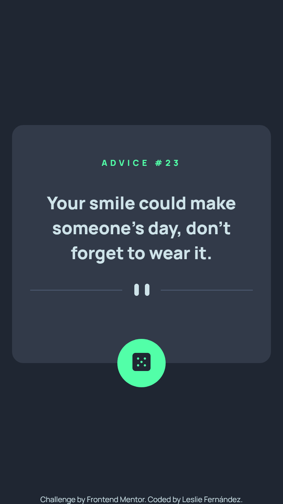
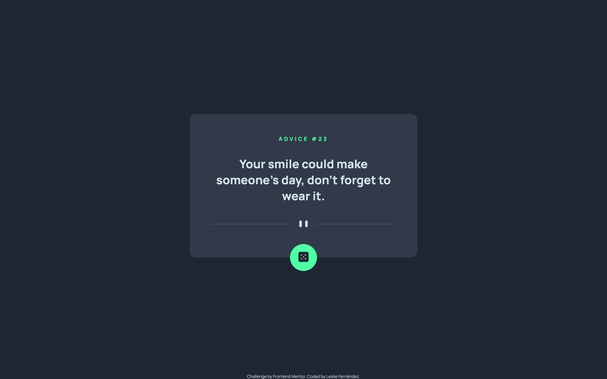

# Frontend Mentor - Advice generator app solution

This is a solution to the [Advice generator app challenge on Frontend Mentor](https://www.frontendmentor.io/challenges/advice-generator-app-QdUG-13db). Frontend Mentor challenges help you improve your coding skills by building realistic projects.

## Table of contents

- [Overview](#overview)
  - [The challenge](#the-challenge)
  - [Screenshot](#screenshot)
  - [Links](#links)
- [My process](#my-process)
  - [Built with](#built-with)
  - [What I learned](#what-i-learned)
  - [Continued development](#continued-development)
- [Author](#author)

## Overview

### The challenge

Users should be able to:

- View the optimal layout for the app depending on their device's screen size
- See hover states for all interactive elements on the page
- Generate a new piece of advice by clicking the dice icon

### Screenshot

### Links

- Live Site URL: [Advice generator app]()
- API Used: [Advice Slip API](https://api.adviceslip.com)

## My process

### Built with

- Semantic HTML5 markup
- CSS custom properties
- Flexbox
- CSS Grid
- Mobile-first workflow
- Vanilla JavaScript

### What I learned

I recently took a class to learn more about APIs and how to consume them, so I think this was the perfect challenge to practice what I learned. I decided to do it with vanilla JS and without any libraries, so I could concentrate only on the consumption of the API. I'm really excited about how this project turned out in general :).

### Continued development

I will keep practicing API consumption and I will like to try and do this project again with React.

## Author

- Website - [Leslie Fernandez](https://github.com/leslief10)